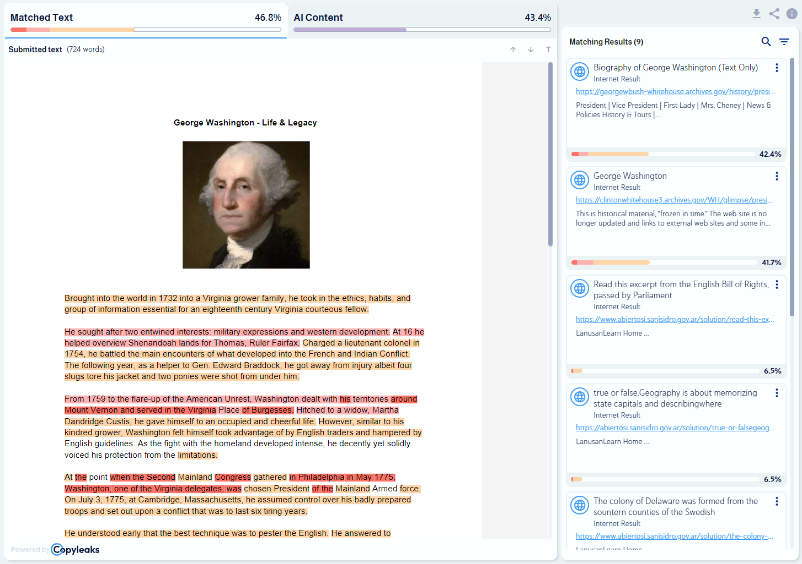
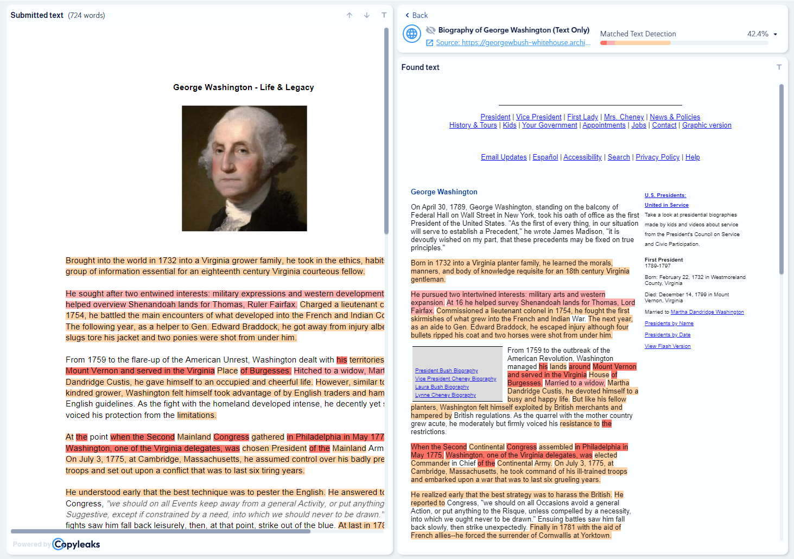
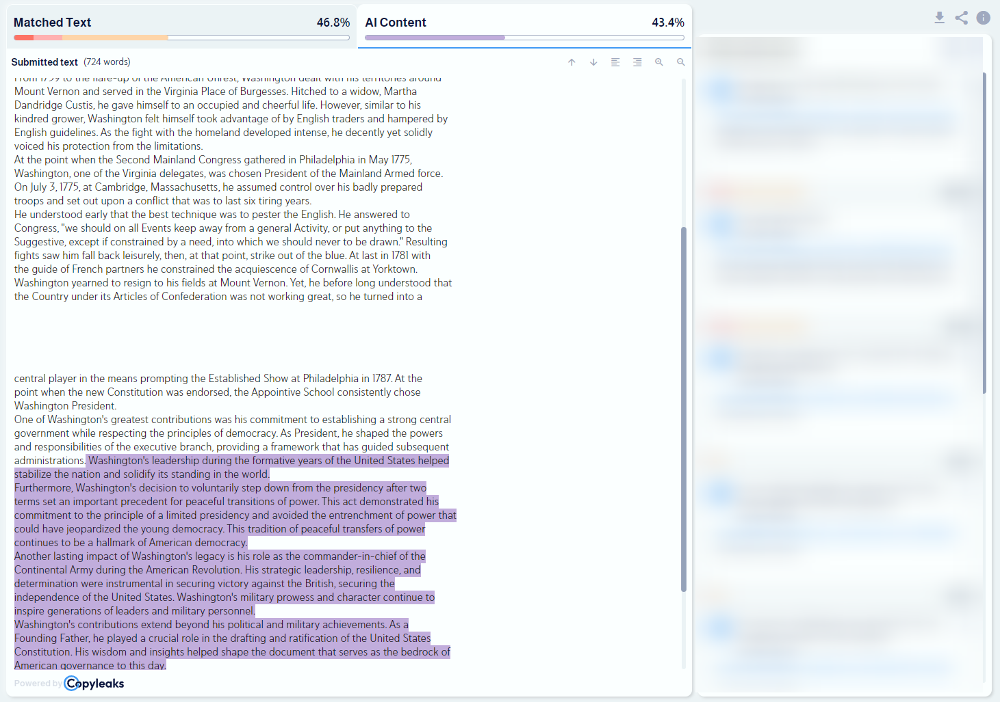

<p align="center">
  
</p>

# Copyleaks Web Report

## Introduction

<p align="center">
      	
	
	
</p>

**Copyleaks Web Report** is an advanced Angular module designed for seamless integration of plagiarism and AI detection reporting. This module, developed by Copyleaks, offers a user-friendly, engaging, and flexible interface for presenting plagiarism and AI content reports, it is designed to showcase the authenticity and uniqueness of submitted files or text

## Key Features

- **Customizable Layouts**: Various layout options for report display.
- **Responsive Design**: Adapts to different screen sizes for a consistent user experience.
- **API Integration**: Configurable endpoints for efficient data retrieval.
- **Accessibility Focused**: Inclusive design for a wider range of users.
- **Error Handling**: Effective management of data retrieval errors.

---

## Installation

To install, run:
`npm install @copyleaks/web-report --save`

---

## Angular Version Support

This module is compatible with **Angular v13**. Ensure your application is using Angular version 13 to avoid compatibility issues.

## Peer Dependencies

The module has several peer dependencies that need to be installed in your project:

- `@angular/localize`: ^13.1.1
- `@angular/material`: ^13.1.1
- `@angular/flex-layout`: ^13.0.0-beta.36
- `scroll-into-view-if-needed`: ^2.2.28
- `ngx-skeleton-loader`: ^5.0.0

Ensure these dependencies are present in your project to guarantee optimal functionality.

---

## Integration

Import the module in your Angular app:

```typescript
import { CopyleaksWebReportModule } from '@copyleaks/web-report';

@NgModule({
	imports: [
		CopyleaksWebReportModule,
		// other imports
	],
})
export class AppModule {}
```

## Using the Component

Add the component in your HTML templates:

```html
<copyleaks-web-report
	[reportEndpointConfig]="endpointConfig"
	[showDisabledProducts]="displayDisabledProducts"
	(onReportRequestError)="handleError($event)"
	(onCompleteResultUpdate)="handleUpdate($event)"></copyleaks-web-report>
```

### Inputs

- **`reportEndpointConfig` - Required**: (`IClsReportEndpointConfigModel`) Configures the data endpoints for fetching the report data, including URLs and headers.
- **`showDisabledProducts` - Optional**: (`boolean`) A flag that deterimnate whether to show disabled products in the report interface or not, the default value is `false`.

### Outputs

- **`onReportRequestError`**: (`EventEmitter<ReportHttpRequestErrorModel>`) Emits an event with HTTP request data when any request to update or fetch report data fails, allowing for custom error handling.
- **`onCompleteResultUpdate`**: (`EventEmitter<ICompleteResults>`) Emits an event when the complete report results data is successfully retrieved, and also when there is an update in the filter options (which are part of the complete results model). This ensures users are properly informed about both the availability of complete results and any changes in the filter dialog data.

### Note on Report View Parameters

The Copyleaks Web Report Module interprets several query parameters to tailor the report view:

- **`contentMode`** (string): Determines the content view type, it accepts `'text'` or `'html'` which will accordingly change the content view mode **only** **if the selected mode is available**.
- **`sourcePage`** & **`suspectPage`** (number): Represent the page number in text view pagination, starting from 1.
- **`suspectId`** (string): The identifier of the selected matching result.
- **`alertCode`** (string): The code of the selected alert.

These parameters allow for dynamic and contextual presentation of the plagiarism report, adapting to user specific requirements.

---

## Configuration and Models

### IClsReportEndpointConfigModel

This model is used for configuring the API endpoints for the plagiarism report data:

- **`crawledVersion`**: Endpoint details for fetching the crawled version of scanned content.
- **`completeResults`**: Endpoint details for fetching complete scanning results.
- **`result`**: Endpoint details for fetching individual scan results.

#### IEndpointDetails

A nested interface in `IClsReportEndpointConfigModel` that defines the structure of each endpoint detail object:

- **`url`**: The URL of the API endpoint.
- **`headers`**: A dictionary of headers for the API call.

Example Usage:

// TODO

## Event Handling

Implement the following event handling methods in your Angular component:

```typescript
import { ICompleteResults, ReportHttpRequestErrorModel } from '@copyleaks/web-report';

...

handleError(error: ReportHttpRequestErrorModel): void {
  // Your error handling logic here
}

handleUpdate(results: ICompleteResults): void {
  // Your logic for processing report updates here
}
```

---

## Advanced Usage

For advanced users, the Copyleaks Web Report offers extensive customization and control over the plagiarism report presentation and data handling. Here are some advanced techniques:

### Custom Templates and Content Injection

Utilize Angular's powerful templating capabilities to create custom layouts and display components for your plagiarism reports, enhancing the user interface and experience.

- **Adding Custom Actions with `<cr-actions>`**:
  Inject custom content directly into the Copyleaks report component. Use the `<cr-actions>` tag to insert fully custom report actions (both logic and style) into the report's interface.

  Example Usage:

  ```html
  <copyleaks-web-report ...>
  	<cr-actions>
  		<!-- Here, you can insert your custom actions, buttons, or any other interactive elements. -->
  	</cr-actions>
  </copyleaks-web-report>
  ```

  This feature allows for a high degree of customization, enabling users to tailor the report actions to their specific needs.

- **Adding Custom Tabs with `<cr-custom-tabs>`**:
  Enhance your plagiarism report with additional information and features using custom tabs. The `<cr-custom-tabs>` component allows for the integration of custom tabs alongside the standard AI and plagiarism tabs. Each tab is represented by a `<cr-custom-tab-item>`, which includes a title and content area defined by `<cr-custom-tab-item-title>` and `<cr-custom-tab-item-content>`. This setup enables you to present additional, tailored content within the report's interface.

  Example Usage:

  ```html
  <copyleaks-web-report ...>
  	<cr-custom-tabs>
  		<cr-custom-tab-item [flexGrow]="0.3">
  			<cr-custom-tab-item-title>Here the title goes</cr-custom-tab-item-title>
  			<cr-custom-tab-item-content>Here the content goes</cr-custom-tab-item-content>
  		</cr-custom-tab-item>
  	</cr-custom-tabs>
  </copyleaks-web-report>
  ```

  The `cr-custom-tab-item` component includes a `flexGrow` input, which sets the `flex-grow` CSS property for the tab. This property determines the tab's width relative to other tabs in the Copyleaks report:
  **`[flexGrow]`**: A numeric value that defines the proportion of the available space inside the flex container that the tab should take up. For example, setting `[flexGrow]="0.3"` on a custom tab and `0.5` on each of the Plagiarism and AI tabs means the custom tab will take up 30% of the available space.

- **Adding Custom Results Section with `<cr-custom-results>`**:
  The `<cr-custom-results>` component allows for extensive customization of the results section in the Copyleaks plagiarism report. It can either complement the existing results or replace them entirely, depending on the use case.

  Example Usage:

  ```html
  <copyleaks-web-report ...>
  	<cr-custom-results [reportView]="reportView">
  		<cr-custom-results-box-content>
  			<!-- Content for the custom results section goes here -->
  		</cr-custom-results-box-content>
  	</cr-custom-results>
  </copyleaks-web-report>
  ```

  The `reportView` input, tied to the `ECustomResultsReportView` enum, dictates the display mode of the custom results section:

  - **`ECustomResultsReportView.Partial` (value `0`)**: When set to `Partial`, the custom results component appears beneath the standard report results.
  - **`ECustomResultsReportView.Full` (value `1`)**: When set to `Full`, the custom results component replaces the entire standard results section.

  The `cr-custom-results-box-content` is used to define the content of the custom results section. Regardless if the `cr-custom-results-box-content` is added ot not this custom results component is displayed with a background animation, making it visually distinct and engaging.

- **Customizing Empty Results with `<cr-custom-empty-results>`**:
  The `<cr-custom-empty-results>` component is designed to provide a custom view for cases where no results are found in the Copyleaks plagiarism report. This allows for a more tailored user experience, particularly when you want to provide specific information or guidance in the event of an empty result set.

  ```html
  <copyleaks-web-report ...>
  	<cr-custom-empty-results>
  		<!-- Custom content for the empty results state goes here -->
  	</cr-custom-empty-results>
  </copyleaks-web-report>
  ```

- **Customizing Locked Results with `lockedResultTemplateRef`**:
  The `lockedResultTemplateRef` input of the `copyleaks-web-report` component enables the customization of locked result presentations within the plagiarism report. This feature is particularly useful for providing a tailored user experience for results that are not immediately accessible or require specific actions to unlock.
  Note that if the template reference isn't passed to the web report component, the default locked result view will be shown.

  ##### **Usage**:

  The `lockedResultTemplateRef` is a template reference variable that you can define in your Angular templates using the `ng-template` directive. You can then pass this template to the `copyleaks-web-report` component to customize how locked results are displayed.

  Example Usage:

  ```html
  <ng-template #lockedResultTemplateRef let-result="result">
  	<!-- Custom content for locked results goes here -->
  </ng-template>

  <copyleaks-web-report ... [lockedResultTemplateRef]="lockedResultTemplateRef" ...></copyleaks-web-report>
  ```

### Adding Real-Time Results

The `CopyleaksWebReportModule` includes the `ReportRealtimeResultsService`, a powerful feature that enables the addition of new results to the real-time view of the plagiarism report. This capability is especially useful for applications where plagiarism check results are received incrementally and need to be displayed to the user as they arrive.

##### **Usage**:

The `ReportRealtimeResultsService` is instrumental when you have the real-time view enabled (which is available if the `progress` endpoint is included in your configuration model). It allows for a dynamic and interactive experience by updating the report with new results as they become available.

The key function in this service is `pushNewResults`, which takes an array of `ResultPreview` objects and adds them to the existing results in the real-time view. This function can be used to incrementally update the report, ensuring that the latest results are always displayed.

Example Usage:

```typescript
import { ReportRealtimeResultsService, ResultPreview } from '@copyleaks/web-report';

@Component({...})
export class YourComponent {
  constructor(private _realtimeResultsService: ReportRealtimeResultsService) {}

  addNewResults(newResults: ResultPreview[]): void {
    this._realtimeResultsService.pushNewResults(newResults);
  }
}
```
